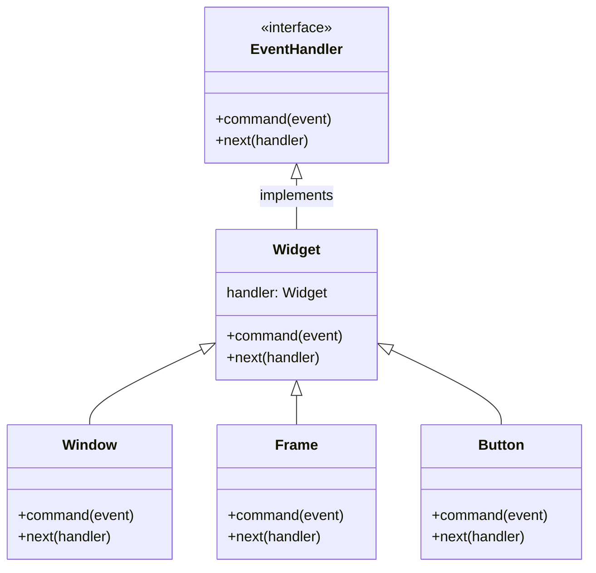

# Chain of Responsibility

A behavioral design pattern that allows us to pass requests along a chain of handlers.

```mermaid
classDiagram
    class EventHandler {
        <<interface>>
        +command(event)
        +next(handler)
    }

    class Widget {
        handler: Widget
        +command(event)
        +next(handler)
    }

    EventHandler <|-- Widget : implements

    class Window {
        +command(event)
        +next(handler)
    }

    class Frame {
        +command(event)
        +next(handler)
    }

    class Button {
        +command(event)
        +next(handler)
    }

    Widget <|-- Window
    Widget <|-- Frame
    Widget <|-- Button

```

