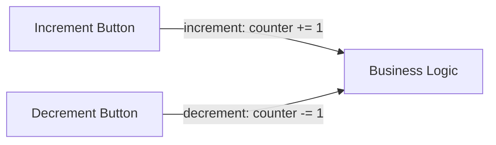
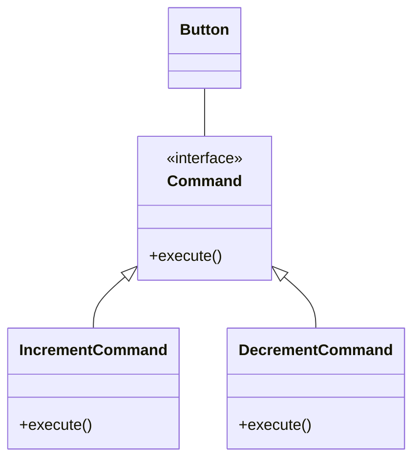

# Command

A behavioral design pattern that encapsulates a request as a stand alone object, allowing parameterization, queuing, and the execution of operations.

## Flowchart

```mermaid
flowchart LR
    Button[Increment Button]
    Button2[Decrement Button]

    Logic[Business Logic]

    Button -->|increment: counter += 1| Logic
    Button2 -->|decrement: counter -= 1| Logic
```

## Class Diagram

```mermaid
classDiagram
    class Command {
        <<interface>>

        +execute()
    }

    class IncrementCommand {
        +execute()
    }

    class DecrementCommand {
        +execute()
    }

    Command <|-- IncrementCommand
    Command <|-- DecrementCommand

    Button -- Command

```
