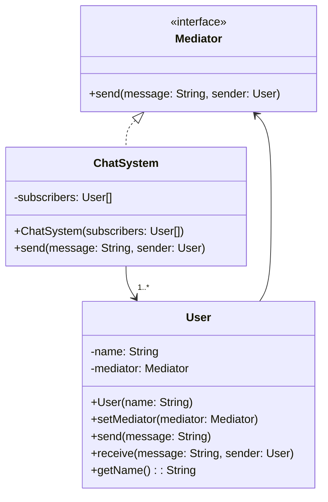

# Mediator

A behavioral design pattern that reduces the dependency between objects.
This design pattern enforces all objects to communicate with each other through the mediator object.

```mermaid
classDiagram
    class Mediator {
        <<interface>>
        +send(message: String, sender: User)
    }

    class ChatSystem {
        -subscribers: User[]
        +ChatSystem(subscribers: User[])
        +send(message: String, sender: User)
    }

    class User {
        -name: String
        -mediator: Mediator
        +User(name: String)
        +setMediator(mediator: Mediator)
        +send(message: String)
        +receive(message: String, sender: User)
        +getName(): String
    }

    Mediator <|.. ChatSystem
    ChatSystem --> "1..*" User
    User --> Mediator
```
