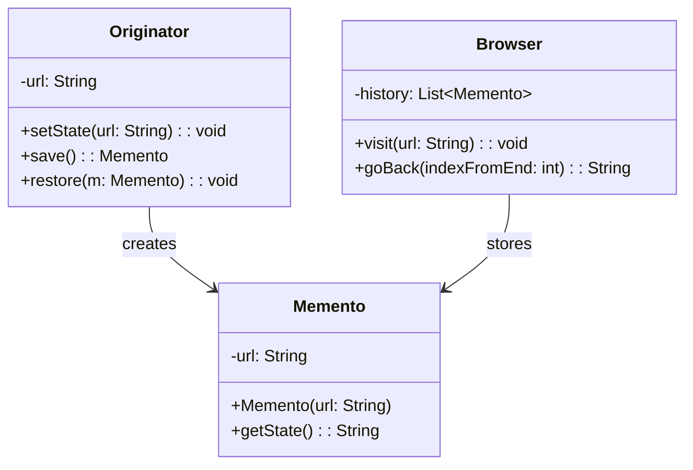

# Memento

A behavioral design pattern that allows us to save and restore state of an object without revealing the implementation.

```mermaid
classDiagram
    class Memento {
        -url: String
        +Memento(url: String)
        +getState(): String
    }

    class Originator {
        -url: String
        +setState(url: String): void
        +save(): Memento
        +restore(m: Memento): void
    }

    class Browser {
        -history: List~Memento~
        +visit(url: String): void
        +goBack(indexFromEnd: int): String
    }

    Originator --> Memento : creates
    Browser --> Memento : stores

```
