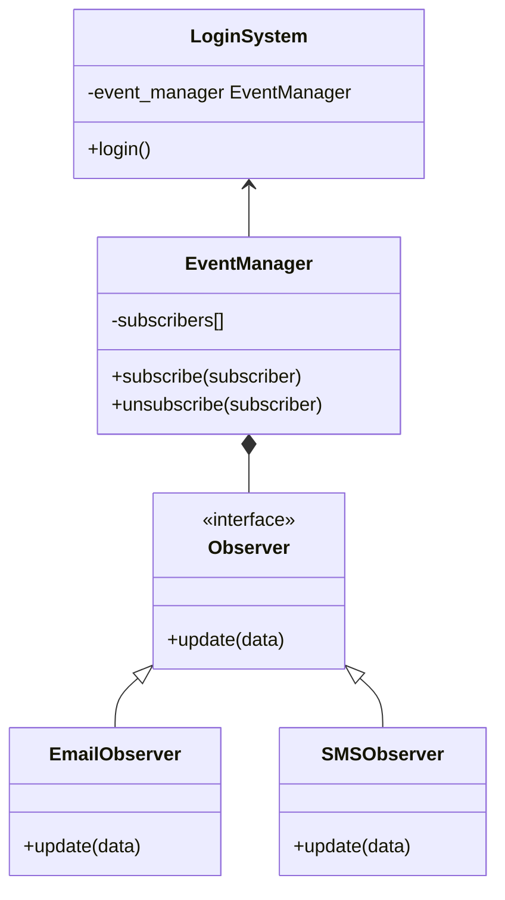

# Observer

A behavioral design pattern that allows us to create a subscription mechanism to notify multiple objects about any events that happen to the object they're observing.

```mermaid
classDiagram
    class Observer {
        <<interface>>
        +update(data)
    }

    class EmailObserver {
        +update(data)
    }

    class SMSObserver {
        +update(data)
    }

    class EventManager {
        -subscribers[]
        +subscribe(subscriber)
        +unsubscribe(subscriber)
    }

    Observer <|-- EmailObserver
    Observer <|-- SMSObserver
    EventManager *-- Observer

    class LoginSystem {
        -event_manager EventManager
        +login()
    }

    LoginSystem <-- EventManager

    
```
