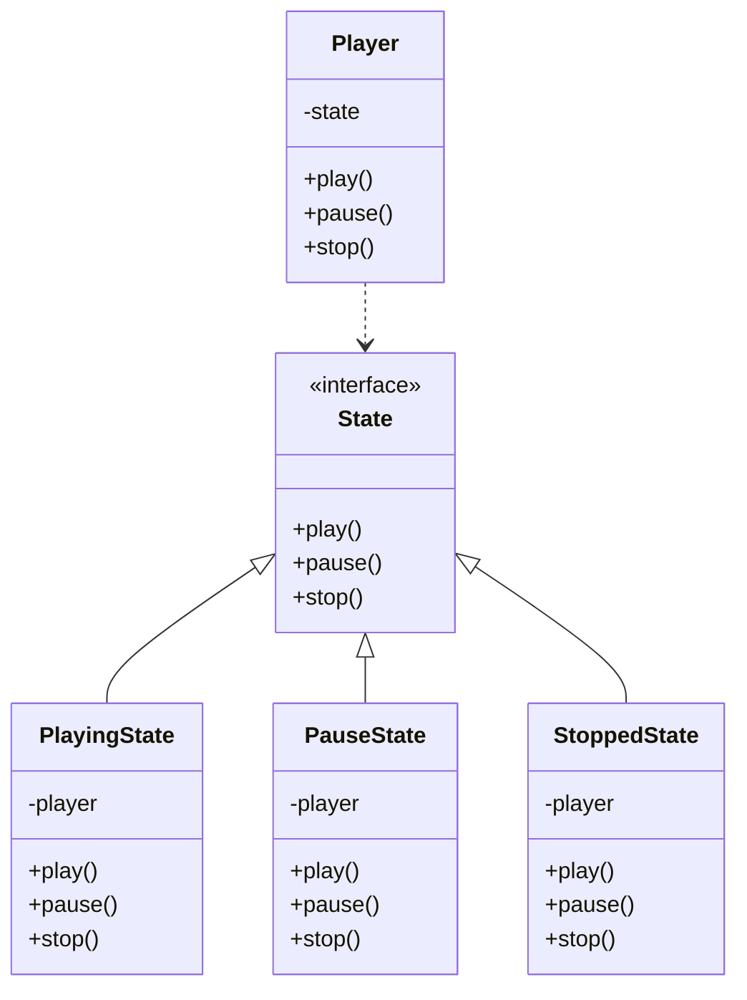

# State

A behavioral design pattern that allows an object to alter its behavior when an internal state changes.

```mermaid
classDiagram
    class State {
        <<interface>>
        +play()
        +pause()
        +stop()
    }

    class PlayingState {
        -player
        +play()
        +pause()
        +stop()
    }

    class PauseState {
        -player
        +play()
        +pause()
        +stop()
    }

    class StoppedState {
        -player
        +play()
        +pause()
        +stop()
    }

    State <|-- PlayingState
    State <|-- PauseState
    State <|-- StoppedState

    class Player {
        -state
        +play()
        +pause()
        +stop()
    }

    Player ..> State
```

