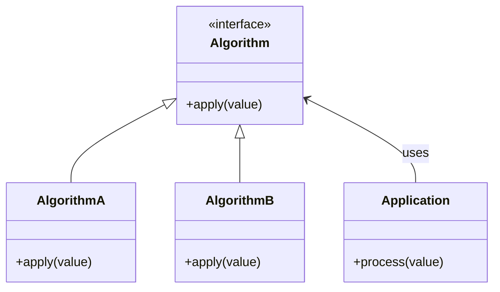

# Strategy

A behavioral design pattern that defines a family of algorithms. It would allow us to interchange algorithms without modifying the actual object.

```mermaid
classDiagram
    class Algorithm {
        <<interface>>
        +apply(value)
    }

    class AlgorithmA {
        +apply(value)
    }

    class AlgorithmB {
        +apply(value)
    }

    class Application {
        +process(value)
    }

    Algorithm <|-- AlgorithmA
    Algorithm <|-- AlgorithmB
    Algorithm <-- Application : uses
```
