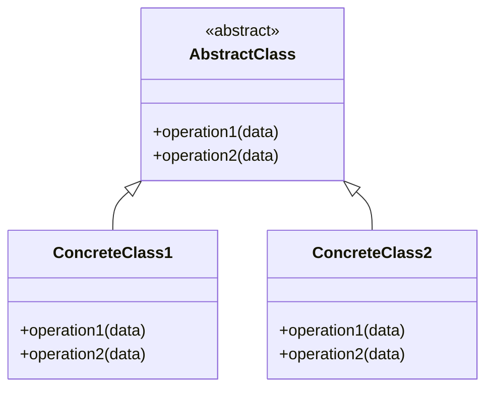

# Template Method

A behavioral design pattern that sets a base class that would allow concrete classes to override implementation of required methods.

```mermaid
classDiagram
    class AbstractClass {
        <<abstract>>
        +operation1(data)
        +operation2(data)
    }

    class ConcreteClass1 {
        +operation1(data)
        +operation2(data)
    }

    class ConcreteClass2 {
        +operation1(data)
        +operation2(data)
    }

    AbstractClass <|-- ConcreteClass1
    AbstractClass <|-- ConcreteClass2
```
