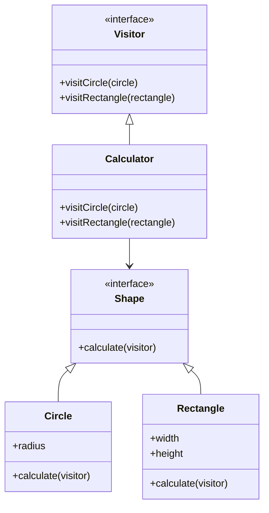

# Visitor

A behavioral design pattern that allows us to define new operations without altering the classes of the elements.

```mermaid
 classDiagram
    class Shape {
        <<interface>>
        +calculate(visitor)
    }

    class Circle {
        +radius
        +calculate(visitor)
    }

    class Rectangle {
        +width
        +height
        +calculate(visitor)
    }

    Shape <|-- Circle
    Shape <|-- Rectangle

    class Visitor {
        <<interface>>
        +visitCircle(circle)
        +visitRectangle(rectangle)
    }

    class Calculator {
        +visitCircle(circle)
        +visitRectangle(rectangle)
    }

    Visitor <|-- Calculator

    Calculator --> Shape
```
