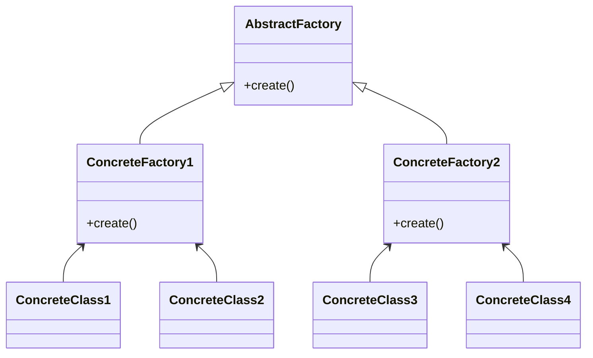

# Abstract Factory

A creational design pattern that let us produce families of related objects without specifying their concrete classes.

```mermaid
classDiagram
    class ConcreteFactory1 {
        +create()
    }

    class ConcreteFactory2 {
        +create()
    }

    class AbstractFactory {
        +create()
    }

    AbstractFactory <|-- ConcreteFactory1
    AbstractFactory <|-- ConcreteFactory2

    
    class ConcreteClass1 {

    }

    class ConcreteClass2 {

    }

    class ConcreteClass3 {

    }

    class ConcreteClass4 {

    }

    ConcreteFactory1 <-- ConcreteClass1
    ConcreteFactory1 <-- ConcreteClass2

    ConcreteFactory2 <-- ConcreteClass3
    ConcreteFactory2 <-- ConcreteClass4

```

