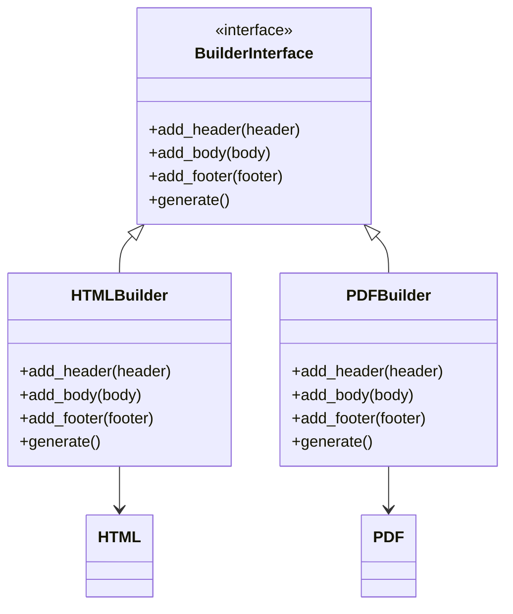

# Builder

A creational design pattern that separates the construction of complex objects.

```mermaid
classDiagram
    class BuilderInterface {
        <<interface>>
        +add_header(header)
        +add_body(body)
        +add_footer(footer)
        +generate()
    }

    class HTMLBuilder {
        +add_header(header)
        +add_body(body)
        +add_footer(footer)
        +generate()
    }

    class PDFBuilder {
        +add_header(header)
        +add_body(body)
        +add_footer(footer)
        +generate()
    }

    BuilderInterface <|-- HTMLBuilder
    BuilderInterface <|-- PDFBuilder

    HTMLBuilder --> HTML
    PDFBuilder --> PDF
```

