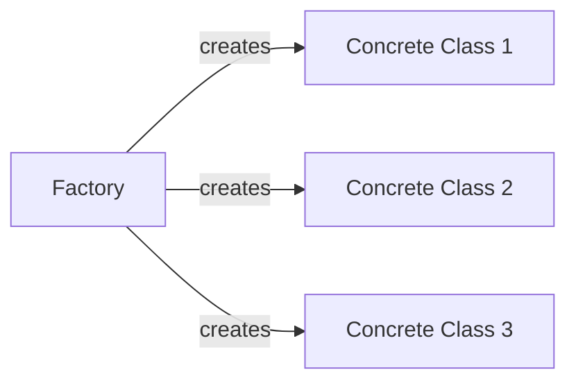

# Factory Design Pattern

A creational design pattern that introduces interface for creating an object.

```mermaid
flowchart LR
    Factory -->|creates| Concrete1[Concrete Class 1]
    Factory -->|creates| Concrete2[Concrete Class 2]
    Factory -->|creates| Concrete3[Concrete Class 3]

```

