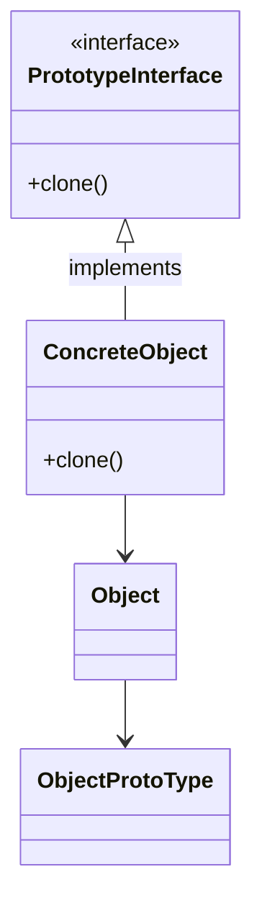

# Prototype

A creational design pattern that allows us to copy an object without making our code dependent on its class. This allows us to copy an object with the state defined on its instantiation and modify it to suit a scenario.

