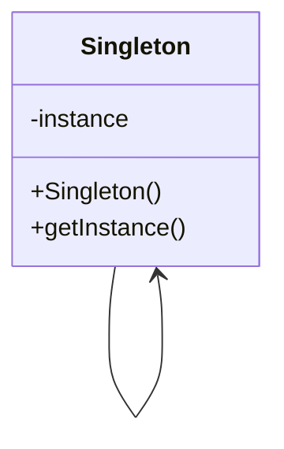

# Singleton

A creational design pattern that ensures we only have one instance of a class.

```mermaid
classDiagram
    class Singleton {
        -instance
        
        +Singleton()
        +getInstance()
    }

    Singleton --> Singleton
```

