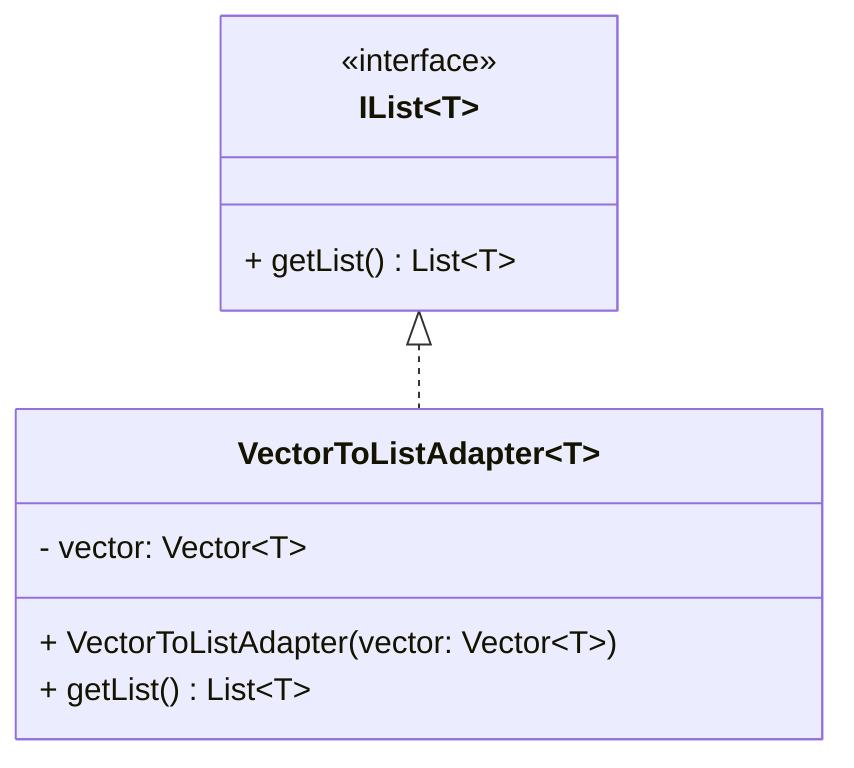

# Adapter Design Pattern

A structural design pattern that allows objects with different interfaces interact with each other. Take for example, an interface for an old printer. The printer might work, but the software required for it to run might not be able to run on newer operating systems. In this case, we might need to find a driver (adapter) that could support the printer.

Another example would be, having to deal with an old system that returns XML data. In order for you to integrate into a newer system, you must convert the data first to a JSON since it was only the supported format of the new system.

## In this example

An Adapter for converting a Vector to List.

