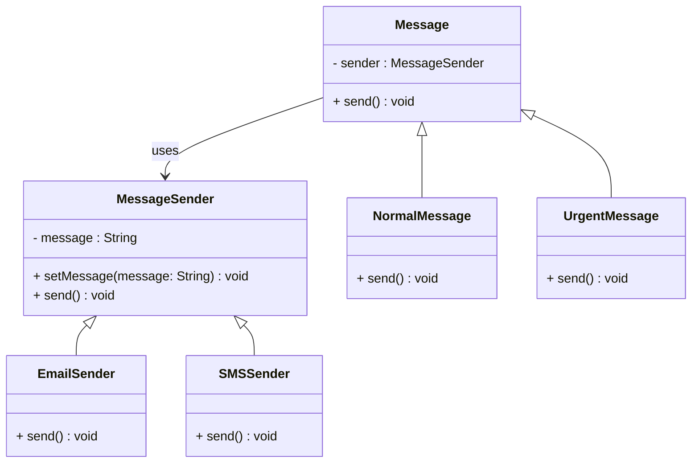

# Bridge Design Pattern

A structural design pattern that separates abstraction from implementation. This allows objects to vary without binding it to the abstraction.

```mermaid
classDiagram

class MessageSender {
    - message : String
    + setMessage(message: String) void
    + send() void
}

class EmailSender {
    + send() void
}

class SMSSender {
    + send() void
}

class Message {
    - sender : MessageSender
    + send() void
}

class NormalMessage {
    + send() void
}

class UrgentMessage {
    + send() void
}

MessageSender <|-- EmailSender
MessageSender <|-- SMSSender

Message <|-- NormalMessage
Message <|-- UrgentMessage

Message --> MessageSender : uses

```
