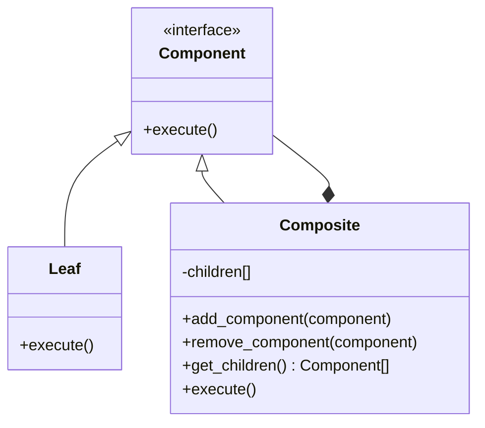

# Composite

A structural design pattern that allows us to compose objects into tree structures to represent part-whole hierarchies then work on individual objects uniformly.

```mermaid
classDiagram
    class Component {
        <<interface>>
        +execute()
    }

    class Leaf {
        +execute()
    }

    Component <|-- Leaf

    class Composite {
        -children[]
        +add_component(component)
        +remove_component(component)
        +get_children() Component[]
        +execute()
    }

    Component <|-- Composite
    Composite *-- Component
```

