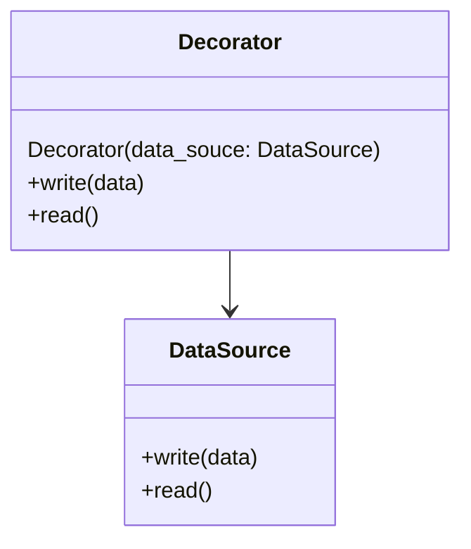

# Decorator

A structural design pattern that allows behaviour to be added to individual objects, either statically or dynamically, without affecting the behaviour of other objects.

```mermaid
classDiagram
    class DataSource {
        +write(data)
        +read()
    }

    class Decorator {
        Decorator(data_souce: DataSource)
        +write(data)
        +read()
    }

    Decorator --> DataSource

```

