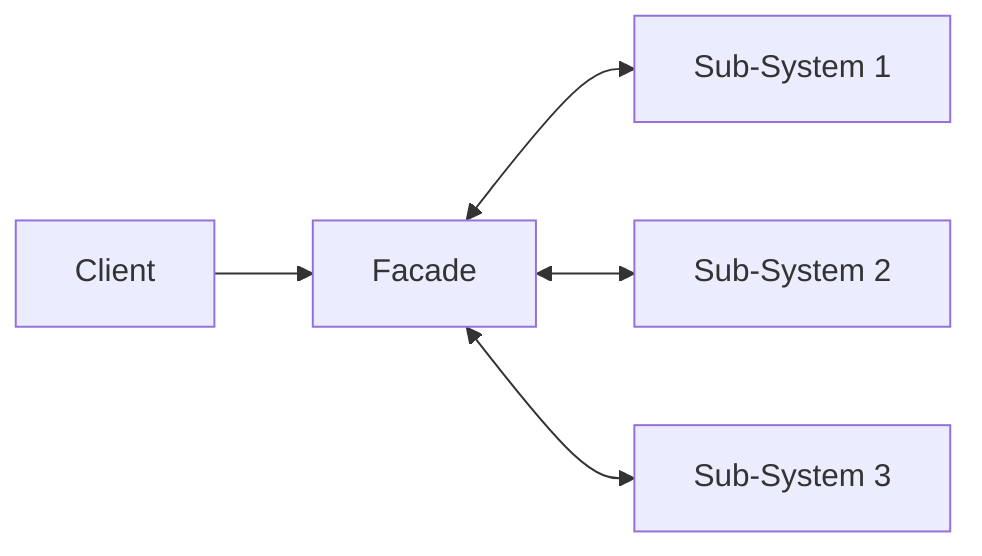

# Facade Pattern
A Structural Design Pattern used to hide complexities and provides a much simpler interface to a library.

## Pros and Cons

| PROS      | CONS      |
|-----------|-----------|
| Code isolation for complex subsystem | Having a class to manage to all |

