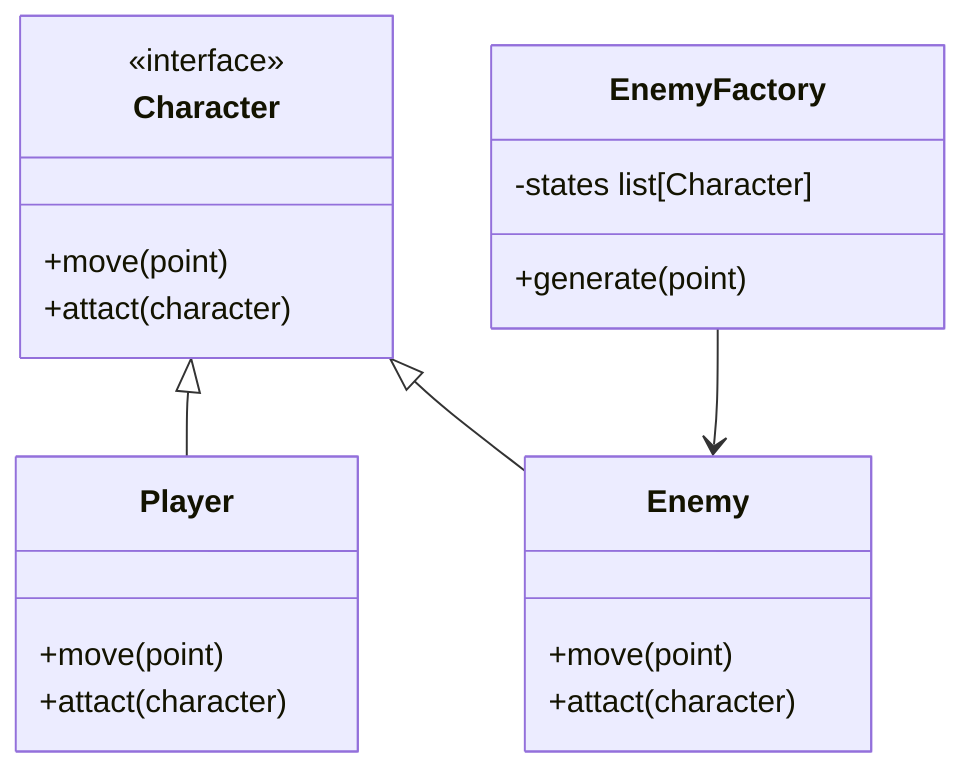

# Flyweight

A structural pattern that allows us to fit more objects into the available amount of RAM by sharing common states between multiple objects.

```mermaid
classDiagram
    class Character {
        <<interface>>
        +move(point)
        +attact(character)
    }

    class Player {
        +move(point)
        +attact(character)
    }

    class Enemy {
        +move(point)
        +attact(character)
    }

    Character <|-- Player
    Character <|-- Enemy

    class EnemyFactory {
        -states list[Character]
        +generate(point)
    }

    EnemyFactory --> Enemy
```

