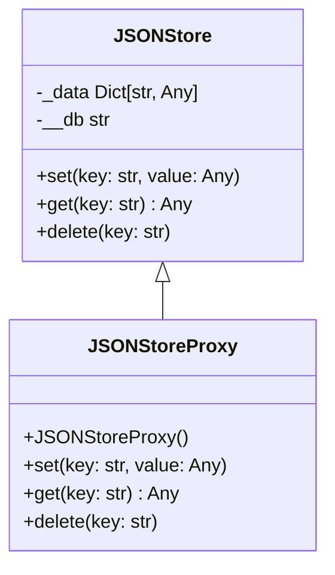

# Proxy

A structural design pattern that allows us to substitute an object with another object.

```mermaid
classDiagram
    class JSONStore {
        -_data Dict[str, Any]
        -__db str

        +set(key: str, value: Any)
        +get(key: str) Any
        +delete(key: str)
    }

    class JSONStoreProxy {
        +JSONStoreProxy()

        +set(key: str, value: Any)
        +get(key: str) Any
        +delete(key: str)
    }

    JSONStore <|-- JSONStoreProxy
```

